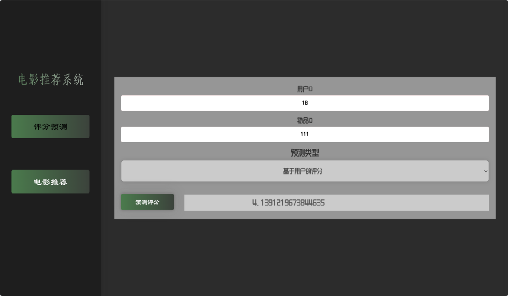
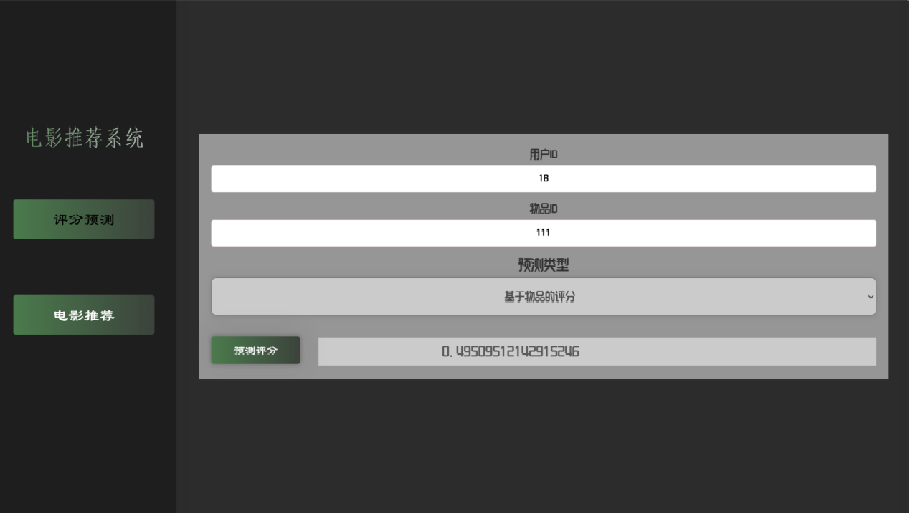

# 电影推荐系统

基于Python实现的电影推荐系统，结合了协同过滤和基于内容的推荐算法，为用户提供个性化的电影推荐服务。

## 功能特性

- **协同过滤推荐**
  - 基于用户的协同过滤：根据用户之间的相似度预测用户对电影的评分
  - 基于物品的协同过滤：根据电影之间的相似度预测用户对电影的评分
  - 获取个性化电影推荐列表

- **基于内容的推荐**
  - 基于电影类型（Genres）的内容相似度计算
  - 根据电影标题获取相似电影推荐

## 技术架构
### 前端技术栈
- HTML＋CSS＋Javascript

### 后端技术栈
- Python 3.１１
- Flask 
- Pandas
- scikit-learn 

## 数据

- 电影信息（MovieID, Title, Genres）
- 用户评分数据（UserID, MovieID, Rating）
### 核心模块
1. **数据加载模块** (`models/data_loader.py`)
   - 加载电影和评分数据
   - 数据预处理和整合

2. **协同过滤模块** (`models/collaborative_filtering.py`)
   - 用户相似度计算
   - 物品相似度计算
   - 评分预测
   - 推荐列表生成

3. **基于内容的推荐模块** (`models/content_based.py`)
   - TF-IDF特征提取
   - 内容相似度计算
   - 相似电影推荐

4. **Web接口** (`app.py`)
   - RESTful API设计
   - 提供多种推荐接口


## API接口

1. **基于用户的评分预测**
   - 接口：`/predict_user_based_rating`
   - 方法：POST
   - 参数：user_id, movie_id

2. **基于物品的评分预测**
   - 接口：`/predict_item_based_rating`
   - 方法：POST
   - 参数：user_id, movie_id

3. **基于内容的电影推荐**
   - 接口：`/content_recommendations`
   - 方法：POST
   - 参数：title, top_n

4. **基于物品的个性化推荐**
   - 接口：`/get_item_based_recommendations`
   - 方法：POST
   - 参数：user_id, top_n

## 运行程序

   ```bash
   python app.py
   ```
## 运行截图


